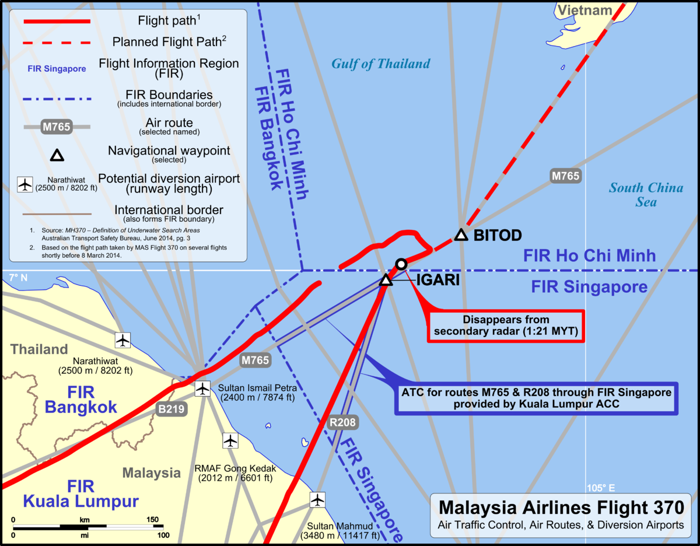
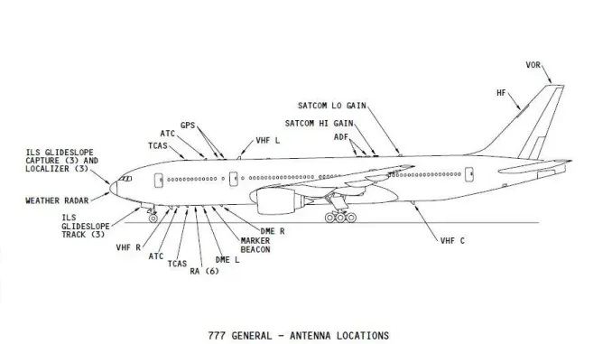

# Exploring Probable Realities: What Could Have Happened on Flight MH370
How could an aircraft filled with 239 people on board vanish? It might seem impossible in todays
era, however this is what exactly happened on Malaysia Airlines flight 370 on March 8th, 2014.
_9M-MRO_-_color.jpg)

## Introduction
The plane which was scheduled for MH370 on 08 March 2014 was 9M-MRO, a Boeing 777-2H6ER with 2x RR Trent 892 engines. The route was initially set for departure towards Beijing from Kuala Lumpur.

First Officer Fariq Abdul Hamid, 27 years old. It was his last training flight before he was signed off for 777 type rating. He had a reputation for being above training average rating, so Malaysia Airlines decided it would be safe for him to be paired by just one captain instead of the usual two captains. 

Captain Zaharie Ahmad Shah, 53 years old. He was one of the experienced captains of the country. He was also a qualified training captain. He spent his free time by flying in his home simulator.

On board MH370 were 227 passengers and 10 flight attendands. 

## Takeoff and Climb
At 00:40am MH370 lined up at runway 32R. First Officer Fariq performed the takeoff. Shortly after takeoff, Zaharie contacted departure control, MH370 has been instructed by ATC to climb to flightlevel 180. They should also cancel their SID (Standard Instrument Departure) and turn right direct waypoint IGARI. 

Departure control handed MH370 over to Lumpur Radar. MH370 has been cleared to climb to flightlevel 250 by Lumpur Radar. So far, everything has been going according to the plan.
At 00:46am they have been cleared to climb to flightlevel 350, which was their cruise altitude.

## Cruise
At 01:00am MH370 had reached their cruise altitude, when it did, Zaharie made a routine call to Lumpur Radar "Malaysian 370, maintaining level 350". Lumpur Radar responded with "Malaysian 370" as acknowledgment. Six minutes later, Zaharie made that exact call again and Lumpur Radar acknowledged again. However, this call was not necessary for Zaharie to do. Sleepiness or forgetfulness could have been responsible. 

From this point on we will apply Occam's razor which holds that the theory which requires the fewest assumptions is most likely to be the right one.

At 01:19am MH370 neared their waypoint "IGARI" and have been told by malaysian air traffic control that they will soon enter vietnamese airspace. ATC: "Malaysian 370, contact Ho Chi Minh, 120.9 Goodnight", Zaharie answered with "Goodnight, Malaysian 370". This call of Zaharie was a first suspicion, as a pilot is required to read back the frequency which they have been told by ATC. However, there was nothing too unusual about this radio call as Zaharie was an experienced pilot in that area. 

## The Vanishing
Just moments after they have been signed off to Ho Chi Minh Airspace by Lumpur Control, Zaharie asked Fariq to get both a cup of coffee. Fariq did so, and left the flightdeck. Now alone in the flightdeck, Zaharie, who had been rehearsing for this night for over a month. Every step and every movement has been  planned with the best precision. Zaharie will now try to make a Boeing 777 vanish from the skies. He locked the flightdeck door.

Zaharie chose exactly this moment between the transition of two airspaces. Malaysian controllers had handed them off to vietnam and vietnamese controllers were busy with their aircrafts already in their airspace. 

tbd: dissapearance between IGARI and BITOD by disabling TCAS and SATCOM

## The Diversion
tbd plausibilise the turn around of the flight route to direction indian ocean

## First notices by Ho Chi Minh
tbd

## Phone Connection
tbd phone connection of f.o. (still under hypoxia) by holding phone against window while turn of plane 

## Malaysia Airlines notices
tbd incl. satcom call from ground

## Trace of MH370: The SDU Arcs
tbd satellite data unit

## The Final Turn of MH370
tbd

## The Simulator
tbd msfx of captain

## Closure and Reflection: Seeking Answers and Remembering Flight MH370
tbd why?

## References
- https://en.wikipedia.org/wiki/Malaysia_Airlines_Flight_370
- https://mh370.radiantphysics.com
- MH370 Safety Investigation Report: https://reports.aviation-safety.net/2014/20140308-0_B772_9M-MRO.pdf
- RMP Report: https://41818.org/docs/rmp/folder1.pdf
- Analysis of Zaharie's simulator: https://s3.amazonaws.com/rootclaim-media/2016-11-29+Further+Analysis+of+Simulator+Data.pdf
- https://en.wikipedia.org/wiki/Occam%27s_razor
- 777 Antenna Locations: https://i0.wp.com/theaviationist.com/wp-content/uploads/2014/03/SATCOM.jpg?resize=678%2C381&ssl=1

### Sharing Insights: My Motivation Behind Unveiling MH370's Mystery
tbd